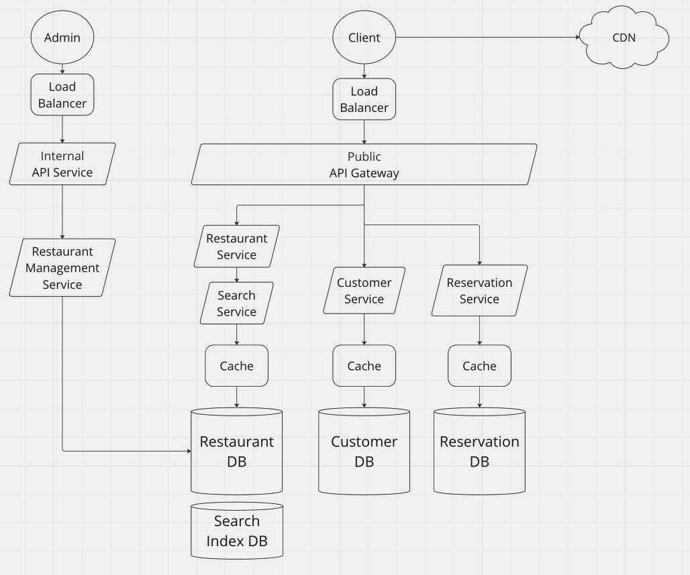

# OpenTable System Design
Restaurant Reservation System Design

## Table of Contents
1. [User Journey](#userjourney)
2. [Requirements](#requirements): 
*functional requirements, non-functional requirements, capacity estimation*
3. [High Level Design](#highlevel):
*API design, database schema*

4. [Design Deepdive](#deepdive):
*database choice and reasoning*
5. [Design Diagram](#diagram)

## User Journey
1. User searches for available restaurants. Provide  *location*, *party size*, *date and time*.
2. User gets a list of **nearby** restaurants with availabilty.
3. User Selects a restarants and make a reservation.

## Requirements 
### Functional Requirements
- get restaurant availability
- view restaurant details
- make booking
- view booking
- manage booking 

### Non-functional Requirements
- High Concurrency
- Moderate latency
- High scalability

### Capacity Estimation
- provide 1,000 nearby restaurants 
- approx. 2 hour for each reservation (may differ by party size)
- Estimated daily reservation: 1,000×100*0.15 ≈ 15,000
    - average restaurant serves 100 customers per day
    - 10%~20% of customers make reservations 
- Reservation made per second: 15,000 / 86,400 ≈ 0.1
    - Reservation Booking page QPS ≈ 1
    - View available restaurants page QPS ≈ 10

## High Level Design 
### API Design
#### Restaurant Availability Related APIs
| API       | Description |
|------------|----------------|
| GET /restaurants/location | Get lists of available nearby restaurants |
| GET /restaurants/ID | Get restaurant details |
| PUT /restaurants/ID | Edit restaurant details *(only available to restaurant managers)* |
| DELETE /restaurants/ID | delete restaurant *(only available to restaurant managers)* |
#### Reservation Related APIs
| API       | Description |
|------------|----------------|
| POST /reservations | Make restaurant reservation|
| GET /reservations/ID | View reservation details |
| PUT /reservations/ID | Edit reservation details |
| DELETE /reservations/ID | delete restaurant |

### Database Schema

<table>
  <thead>
    <tr><th>Restaurant Service</th></tr>
  </thead>
  <tbody>
    <tr><td>restaurant ID</td></tr>
    <tr><td>restaurant name</td></tr>
    <tr><td>address</td></tr>
    <tr><td>rating</td></tr>
    <tr><td>restaurant layout (table)</td></tr>
  </tbody>
</table>

<table>
  <thead>
    <tr><th>Customer</th></tr>
  </thead>
  <tbody>
    <tr><td>customer ID</td></tr>
    <tr><td>customer name</td></tr>
    <tr><td>contact info</td></tr>
  </tbody>
</table>

<table>
  <thead>
    <tr><th>Reservation</th></tr>
  </thead>
  <tbody>
    <tr><td>reservation ID</td></tr>
    <tr><td>restaurant ID</td></tr>
    <tr><td>customer ID</td></tr>
    <tr><td>party size</td></tr>
    <tr><td>start time</td></tr>
    <tr><td>special notes</td></tr>
  </tbody>
</table>

## Design Deepdive 

### Database 

#### SQL Database
**Pros**
- Good for structured data and comples relationships, ensures data integrity through use of foreign keys
- ACID Compliance, suitable for applications requiring precise and accurate data operations.
- Standardizes query language

**Cons**
- Vertical scaling is often required, scaling horizontally is more complex
- Require predefined schema, less flexible when changing data structures

#### noSQL Database
horizontally scalable
reservations are assigned to timeslots in servers that talk to databases

**Pros**
- Designed for horizontal scaling, easier to distribute data across multiple servers
- Schema-less design, flexible and dynamic
- Optimized for fast read/write operations and can handle large-scale data with low latency, suitable for real-time applications and those requiring high-speed data access
- Supports various data models including document stores (e.g., MongoDB), key-value stores (e.g., Redis), column-family stores (e.g., Cassandra), and graph databases (e.g., Neo4j)

**Cons**
- Many prioritize availability and partition tolerance over consistency (CAP theorem), leading to eventual consistency rather than immediate consistency
- complex relationship handling and joins can be challenging and may require data denormalization
- query limitations

#### Conclusion

Considering the pros and cons of relational & non relational databases, and also considering the fact that 1. restaurant reservation prioritize high availability and high loads over data accurac, which implies partition tolerance, and 2. most noSQL databases offer SQL APIs to query, noSQL database is a better option in this context.

## Overall Design 
